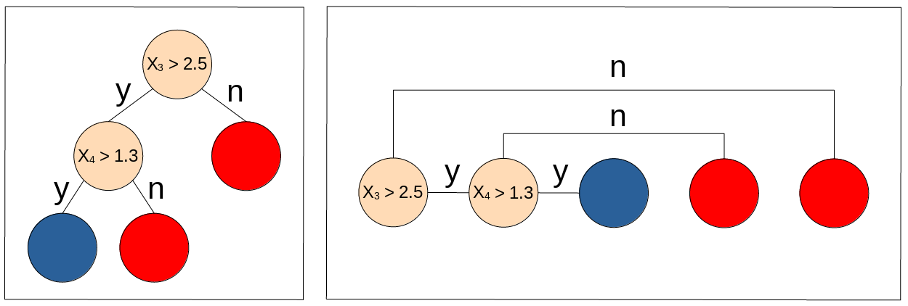

# iterative-dichotomiser-3
A vector based implementation of the Iterative Dichotomiser 3 (ID3) algorithm by John Ross Quinlan

The data used consists of the price, weight, page count and the height and the width of the book. The labels are 0 for history/social 1 for computer science and 2 for fiction. Altough not a big dataset, it is good to validate the functionality of the tree because it leads to results understandable for humans.

## Concept

The basic idea is that the 2 dimensional tree structure (left) can be reduced to 1 dimension almost like a chain (right). In order to work, the nodes must contain information about class decision (feature and threshold) and connections to the  child nodes

A tree in the 2 dimensional structure needs node objects to store this information with references to the child nodes as connections. 

Since all nodes in the 1 dimensional representation can be easily indexed *[0..n]*. Since satisfying the condition for a given decision node with index m simply leads to the node with the index m+1, only one integer number is needed for decision nodes to store the "jumps".

Class, feature and threshold are also stored as single numbers. However, as classification uses class labels from 0 to number of classes - 1, the amount of variables needed to be stored can be further reduced by combining the class and feature. For doing so the formula *-(label + 1)* is used meaning that for the lowest class label (0) a negative and therefore invalid feature index is calculated. When looking at the feature/class value, the program is then able to determine whether it has reached a leaf node.

Storing the information of each node in three vectors (features/class, thresholds and jumps) allows for placing all the information of a node in the same index. Since the root node always has the index 0, the path to the next node can be easily calculated by either incrementing the index to 1 or by jumping to the index stored in jumps[0] depending on whether the condition based on *feature/class[0]* and *thresholds[0]* was satisfied. The process is then repeated until a invalid (i.e. negative) feature is met, which means that the program has arrived at a leaf node. When returning the prediction, the modified class label is then transformed back to the corresponding value between *0* and *number of classes-1*

## Example
Assuming that "blue" is encoded as 0 (transformed to -1) and "red" is encoded as 1 (transformed to -2), the tree from the image above leads to the following table with the node column for an easier understanding and the other columns corresponding to one of the needed vectors:

| node | features | thresholds | jumps |
|------|----------|------------|-------|
| 0    | 3        | 2.5        | 4     |
| 1    | 4        | 1.3        | 3     |
| 2    | -1       | x          | x     |
| 3    | -2       | x          | x     |
| 4    | -2       | x          | x     |

The datapoint d = {2.3, 5.5, 1.8, 2.6, 0.9} needs to be classified. Starting with the first node at the index 0.
- The value of *features[0]* = 3, meaning that it is a valid index and therefore it is a decision node. We then proceed to check whether the condition of the node is satisfied. *datapoint[3] > thresholds[0]* means that the condition is satisfied and the index is simply incremented by 1. 
- The value of *features[1]* = 4, meaning that the current node is a decision node. However, *datapoint[4] < thresholds[1]*. This means that the condition is not satisfied and that we have to jump to the index *jumps[1] = 3*.
- The value of *features[3] = -2* is lower than 0 and can therefore not be used to index a feature, which means that it is a leaf node.
- Using *-(feature+1)*, we get class 1. d therefore belongs to "red"
